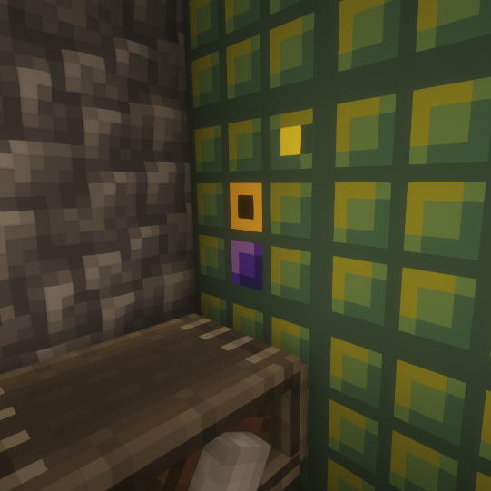

--- 
title: Compact Machines
---
Akin to my [FEH mod for EMI](feh.html), I have written a 
[fabric port of Compact Machines in scala](https://github.com/TheDrawingCoder-Gamer/compactmachines-scala).
It supports compact machines. I made a custom texture pack based off the 
[original forge version](https://github.com/CompactMods/CompactMachines).
Tunnels let you transfer items, fluids, and energy in and out of the compact machine

