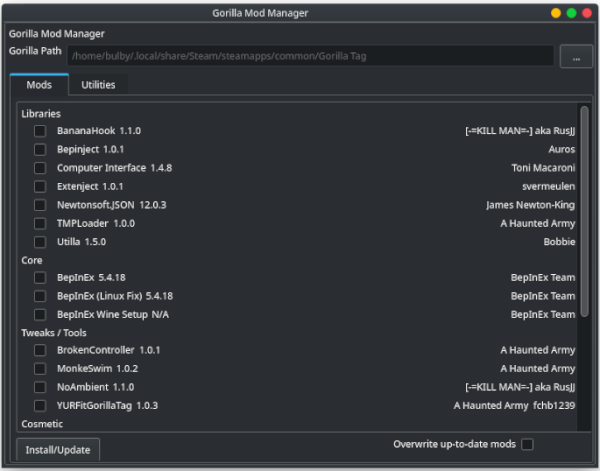

Whenever I write a UI app I think of HaxeUI. HaxeUI is one of my favorite UI frameworks that can compile to
web, QT, GTK, windows, and more. It uses css to style and in general fits the native theme.

I've made a mod manager based off of Monke Mod Manager that is cross platform. 
The [original Monke Mod Manager](https://github.com/DeadlyKitten/MonkeModManager) is 
written in C# and thus isn't cross platform.

While in a different language, this is related to my modding in general. My [FEH EMI mod](feh.html) and 
[Compact Machines Port](cm.html) for minecraft have a similar idea.

